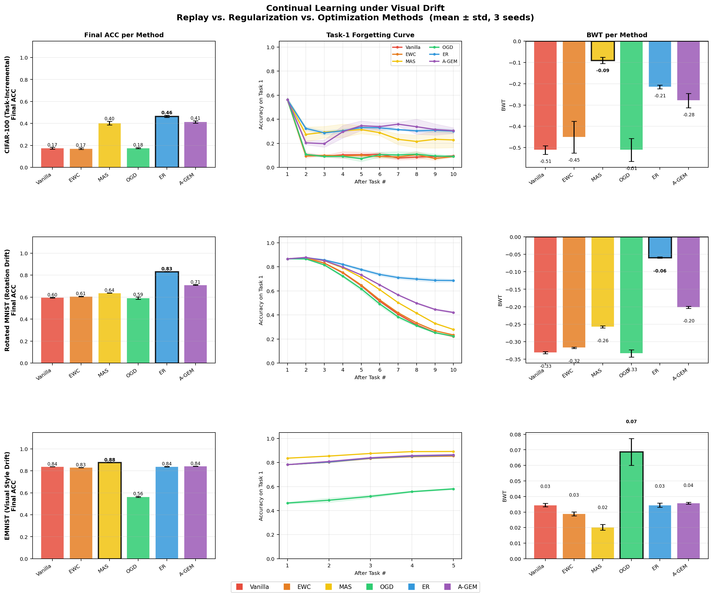
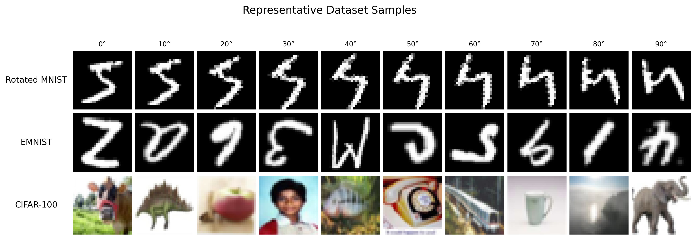
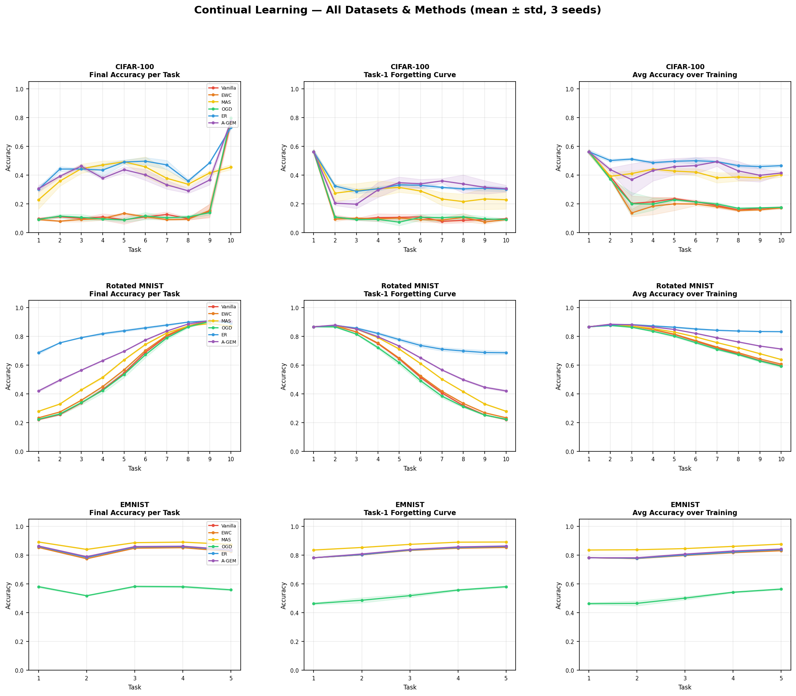
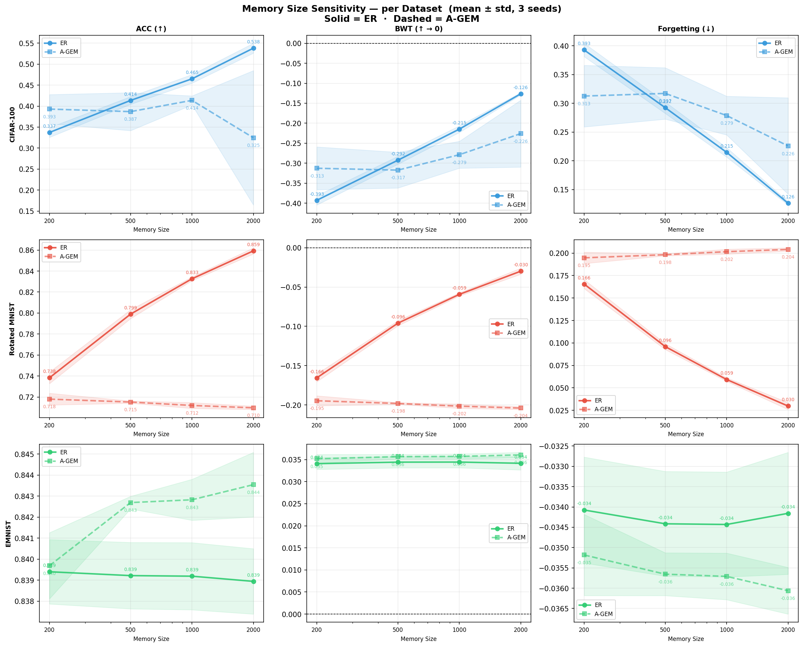
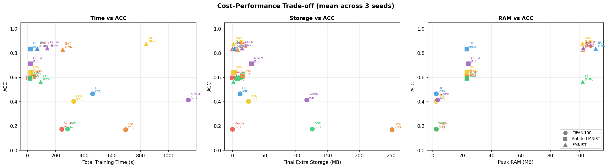

# An Empirical Evaluation of Continual Learning under Visual Drift

Experimental code, results, and analysis for an MSc research project on catastrophic forgetting under visual and semantic distribution shift.

This project compares six continual-learning strategies across three image benchmarks. The central question is:

> How effectively can replay-based methods reduce catastrophic forgetting under visual drift, compared with regularisation-based and optimisation-based alternatives?

The study evaluates **Vanilla fine-tuning, EWC, MAS, OGD, Experience Replay, and A-GEM** on **Rotated MNIST, EMNIST, and CIFAR-100**. Every main experiment is repeated with three random seeds, reported as mean and standard deviation, and accompanied by training-time and auxiliary-storage measurements.

## Highlights

- **Experience Replay performs best when forgetting is the dominant problem.** It reaches 83.3% final accuracy on Rotated MNIST and 46.5% on CIFAR-100.
- **EMNIST is a positive-transfer case rather than a pure forgetting benchmark.** MAS performs best at 87.7%, while most methods have positive backward transfer.
- **Replay-buffer size matters on genuine drift.** Increasing the ER buffer from 200 to 2000 raises final accuracy from 73.8% to 85.9% on Rotated MNIST and from 33.7% to 53.8% on CIFAR-100.
- **ER offers the strongest observed cost-accuracy trade-off.** On CIFAR-100 it uses 11.73 MB of auxiliary storage, compared with 117.26 MB for A-GEM and 251.48 MB for EWC in the recorded runs.
- **OGD often sacrifices plasticity.** Its projection constraints provide little benefit on Rotated MNIST and CIFAR-100 and substantially reduce learning accuracy on EMNIST.

## Results at a glance



Main comparison results use seeds 0, 1, and 2. Values below are final average accuracy (ACC).

| Method | Rotated MNIST | EMNIST | CIFAR-100 |
| --- | ---: | ---: | ---: |
| Vanilla | 0.596 ± 0.003 | 0.839 ± 0.001 | 0.174 ± 0.007 |
| EWC | 0.607 ± 0.002 | 0.831 ± 0.001 | 0.171 ± 0.008 |
| MAS | 0.639 ± 0.002 | **0.877 ± 0.001** | 0.403 ± 0.017 |
| OGD | 0.591 ± 0.010 | 0.564 ± 0.006 | 0.175 ± 0.005 |
| ER | **0.833 ± 0.002** | 0.839 ± 0.002 | **0.465 ± 0.010** |
| A-GEM | 0.712 ± 0.003 | 0.843 ± 0.001 | 0.414 ± 0.011 |

Full ACC, BWT, learning-accuracy, forgetting, and standard-deviation values are available in [the multi-seed summary](reports/summary_multiseed.csv). A detailed interpretation is provided in [the experiment report](reports/experiment_report.md).

## Experimental design

### Benchmarks

| Benchmark | Drift scenario | Protocol | Tasks | Model | Epochs per task |
| --- | --- | --- | ---: | --- | ---: |
| Rotated MNIST | Smooth geometric rotation from 0° to 90° | Domain-incremental | 10 | MLP | 1 |
| EMNIST | Identity, rotation, blur, brightness, and mixed appearance transforms | Domain-incremental, shared 36-class label space | 5 | MLP | 1 |
| CIFAR-100 | Ten disjoint groups of ten object classes | Task-incremental with task-aware logit masking | 10 | CNN | 20 |

Rotated MNIST tests gradual geometric drift while preserving digit labels. EMNIST tests whether shared labels and related transformations encourage positive transfer. CIFAR-100 introduces larger semantic changes and provides the most demanding forgetting scenario.



### Methods

| Family | Method | Core mechanism | Additional state |
| --- | --- | --- | --- |
| Baseline | Vanilla | Sequential fine-tuning without forgetting protection | None |
| Regularisation | EWC | Penalises changes to parameters with high Fisher importance | Fisher estimates and parameter snapshots |
| Regularisation | MAS | Protects parameters according to output sensitivity | Importance weights and parameter snapshots |
| Optimisation | OGD | Projects gradients away from previous task directions | Stored gradient directions |
| Replay | ER | Mixes samples from a fixed replay buffer into later training | Fixed episodic buffer |
| Replay + constraint | A-GEM | Projects updates that conflict with gradients from episodic memory | Task memories and reference gradients |

### Evaluation metrics

Let R[i,j] be test accuracy on task j after the model has trained through task i.

| Metric | Interpretation | Direction |
| --- | --- | --- |
| ACC | Mean accuracy over all tasks after the final task | Higher is better |
| BWT | Change in earlier-task performance after learning later tasks | Closer to zero is better; positive values indicate beneficial backward transfer |
| LA | Mean accuracy measured immediately after each task is learned | Higher is better |
| Forgetting | Reported as -BWT in this project | Lower is better |
| Training time | Total wall-clock training time across tasks | Lower is better |
| Extra storage | Final size of method-specific auxiliary state | Lower is better |

## Main findings

### Rotated MNIST

ER obtains **0.833 ± 0.002 ACC** and only **0.059 ± 0.002 forgetting**, outperforming A-GEM by 12.1 percentage points and MAS by 19.4 points in final accuracy. Learning accuracy is similar across methods, so the final gap is primarily explained by differences in retention.

### EMNIST

Most methods produce positive BWT because later appearance transformations improve the shared representation for earlier transformations. MAS achieves the best final accuracy at **0.877 ± 0.001**. Replay provides little advantage because catastrophic forgetting is not the dominant effect in this setting.

### CIFAR-100

ER leads at **0.465 ± 0.010 ACC**, followed by A-GEM at 0.414 and MAS at 0.403. Vanilla, EWC, and OGD remain near 0.17, showing that simple fine-tuning, Fisher-based regularisation, and orthogonal projection struggle under large semantic shifts.



## Buffer and memory sensitivity

ER and A-GEM were evaluated with configured capacities of 200, 500, 1000, and 2000 samples.

| ER buffer | Rotated MNIST ACC | EMNIST ACC | CIFAR-100 ACC |
| ---: | ---: | ---: | ---: |
| 200 | 0.738 ± 0.006 | 0.839 ± 0.002 | 0.337 ± 0.012 |
| 500 | 0.799 ± 0.004 | 0.839 ± 0.002 | 0.414 ± 0.009 |
| 1000 | 0.833 ± 0.002 | 0.839 ± 0.002 | 0.465 ± 0.010 |
| 2000 | 0.859 ± 0.003 | 0.839 ± 0.002 | 0.538 ± 0.012 |

ER improves monotonically with buffer size on Rotated MNIST and CIFAR-100, while EMNIST remains effectively unchanged. A-GEM does not show the same consistent scaling and becomes unstable on CIFAR-100 at the largest tested memory setting.



## Computational trade-offs

The repository records training time, peak RAM/GPU allocation, and method-specific storage for each task. On CIFAR-100, ER combines the highest final accuracy with substantially less auxiliary storage than EWC, OGD, or A-GEM.

| CIFAR-100 method | Training time | Extra storage | ACC |
| --- | ---: | ---: | ---: |
| Vanilla | 243 ± 2 s | 0.00 MB | 0.174 |
| EWC | 694 ± 3 s | 251.48 MB | 0.171 |
| MAS | 327 ± 2 s | 25.15 MB | 0.403 |
| OGD | 283 ± 2 s | 125.74 MB | 0.175 |
| ER | 461 ± 0 s | 11.73 MB | **0.465** |
| A-GEM | 1139 ± 1 s | 117.26 MB | 0.414 |



## Repository layout

```text
.
|-- rotated_mnist/       # Rotated MNIST loader and six CL methods
|-- emnist/              # EMNIST loader, models, methods, and per-run results
|-- cifar100/            # CIFAR-100 loader, CNN, methods, and per-run results
|-- iam/                 # Additional IAM handwriting experiments
|-- reports/             # Aggregate CSV files, figures, and English reports
|-- scripts/             # Minor-correction document utilities
|-- tools/               # Dataset-figure and report-generation utilities
|-- run_*.sh             # Main, fair-comparison, and ablation runners
|-- aggregate_results.py # Multi-seed result aggregation
|-- calc_metrics.py      # Continual-learning metrics
|-- cost_tracker.py      # Time, memory, and storage instrumentation
`-- requirements.txt    # Python dependencies
```

Raw datasets, virtual environments, caches, local logs, editor settings, and credentials are excluded from version control.

## Installation

Python 3.9 or newer is recommended. PyTorch can use CUDA, Apple MPS, or CPU depending on the selected experiment and local installation.

```bash
git clone https://github.com/Augustin-Liu-666/continual-learning-eval.git
cd continual-learning-eval

python3 -m venv .venv
source .venv/bin/activate
python -m pip install --upgrade pip
python -m pip install -r requirements.txt
```

MNIST, EMNIST, and CIFAR-100 are downloaded automatically by `torchvision` into `data/`. IAM data is not redistributed and must be arranged locally as:

```text
data/iam/
|-- images/
`-- meta/labels.txt
```

Each line of `labels.txt` must contain `image_name,label`.

## Reproducing the experiments

Run all commands from the repository root.

```bash
# Main three-seed experiment suite
bash run_multiseed.sh

# Unified-epoch reruns used for the fair comparisons
bash run_rmn_fair.sh
bash run_emnist_fair.sh

# ER and A-GEM capacity ablations
bash run_buffer_sensitivity.sh
bash run_agem_buffer_sensitivity.sh

# A-GEM capacity-1000 reruns
bash run_agem_mem1000.sh
```

The runners use `python3` by default. Select another interpreter with:

```bash
PYTHON=/path/to/python bash run_multiseed.sh
```

Run an individual experiment directly:

```bash
PYTHONPATH=. python3 cifar100/method_er/cifar100_er.py \
  --buffer_size 1000 \
  --seed 0 \
  --epochs 20
```

Aggregate existing runs and regenerate the main figures:

```bash
python3 aggregate_results.py
python3 plot_thesis_summary.py
python3 plot_linecharts.py
python3 plot_buffer_sensitivity.py
python3 plot_costs.py
```

The included Colab notebook provides a lightweight entry point for the CIFAR-100 Vanilla baseline: [colab_train_cifar100_vanilla.ipynb](colab_train_cifar100_vanilla.ipynb).

## Reproducibility and limitations

- Main results use random seeds `0`, `1`, and `2`; no formal significance tests are reported.
- Epoch budgets are unified within each benchmark: 1 epoch per task for Rotated MNIST and EMNIST, and 20 for CIFAR-100.
- ER uses a fixed replay buffer. In the current A-GEM implementation, episodic memory is allocated per task and can accumulate across tasks. Therefore, a configured value of 1000 does **not** imply a strictly equal final memory budget between ER and A-GEM.
- Architectures and most hyperparameters are fixed rather than exhaustively tuned for every method.
- Cost measurements are hardware- and implementation-dependent; they are most useful for relative comparisons within this experiment suite.
- IAM is retained as an additional exploratory benchmark but is not part of the three-dataset headline comparison.

## Project outputs

- [Full experiment report](reports/experiment_report.md)
- [Multi-seed metric summary](reports/summary_multiseed.csv)
- [English progress report](reports/supervisor_progress_report_en.md)
- [English report attachment](reports/supervisor_progress_report_attachment_en.pdf)
- [Main summary figure](reports/thesis_summary.png)
- [Buffer-sensitivity figure](reports/buffer_sensitivity_by_dataset.png)
- [Cost-accuracy figure](reports/cost_vs_acc_scatter.png)

## Author

Changlin Liu<br>
MSc Computer Science research project
